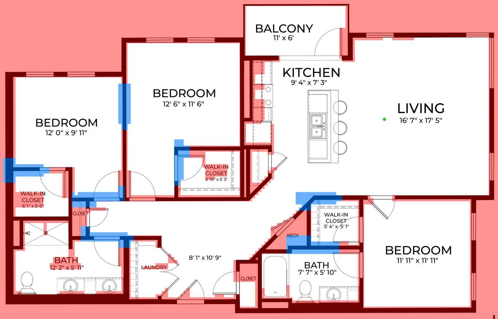
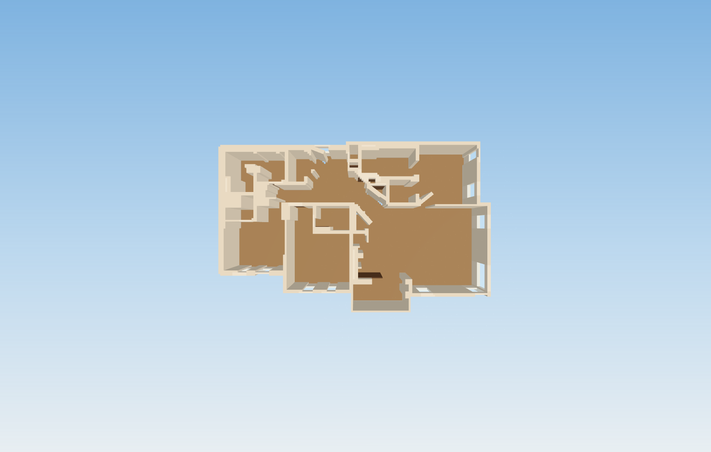
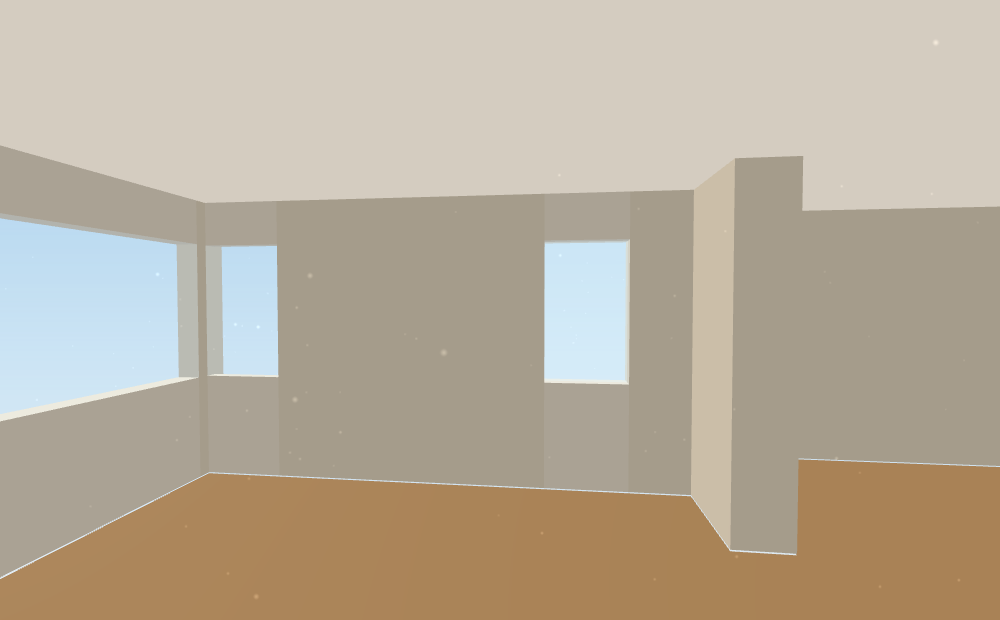
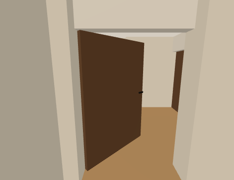

# Blueprint Explorer


A floor plan is just lines on paper and a north arrow. Most people can't turn that into a
mental picture of the actual place — where the light lands, whether the kitchen's too tight,
whether the bedroom door bangs into the closet. This takes the lines and gives you back a
building you can actually walk into.

Drop in a PNG, JPG, or PDF of a floor plan. It figures out the walls, doors, windows, and
rooms on its own, builds the thing in 3D, and hands you first-person control. No CAD file,
no modeling software, no one tracing walls by hand.

<table>
<tr>
<td width="50%"><p align="center"><sub>what you upload</sub></p></td>
<td width="50%"><p align="center"><sub>what you get</sub></p></td>
</tr>
</table>

## Why this exists

Nobody looks at a blueprint and just *knows* what the living room feels like. Real estate
listings solve this with expensive staged renders, made by hand, one unit at a time, weeks
before anyone can actually visit. This does the same job from a picture of the plan itself —
no artist, no render farm, no wait.

## What it actually does

Point it at a floor plan and it separates the walls from everything else drawn on top of
them — door swing arcs, furniture, room labels, dimension lines — by how thick the ink is.
Walls get drawn thick on every real blueprint; everything else doesn't. That one distinction
is what makes the rest of it work: real doorways land where the plan actually draws them,
windows come out as glass instead of solid wall, and a countertop doesn't get mistaken for
a 2.5-meter partition wall down the middle of the kitchen.

From there:

- Rooms get segmented and named — kitchen, bedroom, bath, whatever the plan calls out — and
  show up labeled on a minimap, sub-rooms and all.
- Doors swing open toward wherever they actually have room to swing, with a handle on each
  face, and stop when they hit something instead of clipping through a wall.
- Get the scale wrong on upload? Type in the real width and hit rebuild — no re-uploading.
- A cupboard that's too small to stand in gets bricked up instead of leaving a door that
  opens onto nothing, which used to be the single most confusing thing to run into mid-walk.

<p align="center">


</p>

## Running it

```
py -m pip install -r requirements.txt
py server.py
```

Open `http://localhost:8000`, upload a plan from the side panel, walk in. WASD to move,
mouse to look, click a door to open it.

You'll also need a JDK 17 and Maven on `PATH` — the geometry step shells out to Maven rather
than shipping a prebuilt jar.

Prefer the terminal:

```
py tools/build_level.py blueprints/my_house.png --width-metres 10.5
```

And a sanity check that the whole pipeline still holds together end to end:

```
py tools/test_convert.py
```

## How it's put together

```
floor plan image
      |  Python -- separates walls from symbols, detects doors/windows, writes a text grid
      v
text grid  (1 wall / 0 floor / 3 doorway / 4 window / ...)
      |  Java -- turns the grid into wall/door/window geometry
      v
level JSON
      |  Three.js -- renders it, handles movement and collision
      v
your browser
```

Three languages, one pipeline, each doing the part it's actually good at. The Python side
never touches 3D, the Java side never touches pixels, and the browser never has to guess
what's a wall versus what's a window — it just reads it off the grid.

If you're digging into the code itself, [ARCHITECTURE.md](ARCHITECTURE.md) has the real
detail: why stroke thickness is what separates a wall from a door swing arc, how the room
segmentation handles an open floor plan instead of assuming every room has four walls and a
door, and the specific bugs that shaped half the guard clauses in this codebase.

## Project layout

| Path | What's there |
|---|---|
| `server.py` | Dev server — serves the page, runs upload → convert → build on request |
| `tools/blueprint_to_grid.py` | The image-processing stage: image in, text grid out |
| `tools/build_level.py` | Terminal entry point; also the thing that finds Maven for you |
| `src/main/java/com/blueprint/` | Grid → 3D level geometry |
| `web/` | The browser app — `index.html`, `main.js`, `style.css`, no bundler |
| `blueprints/` | Sample and saved floor plans, as source images and converted grids |

## Rough edges

Worth knowing before you judge it too harshly:

- A wall drawn at an angle still rasterizes as a staircase of small boxes in a couple of
  views. It reads fine while walking, less fine if you stop and stare at it head-on.
- Rooms below about a square meter get bricked up rather than kept as tiny, awkward closets
  — there's no in-between yet for "small room" versus "not really a room."
- No furniture. Every space renders empty on purpose — floor, walls, windows, doors, nothing
  staged. It's a shell you can judge honestly, not a showroom.
